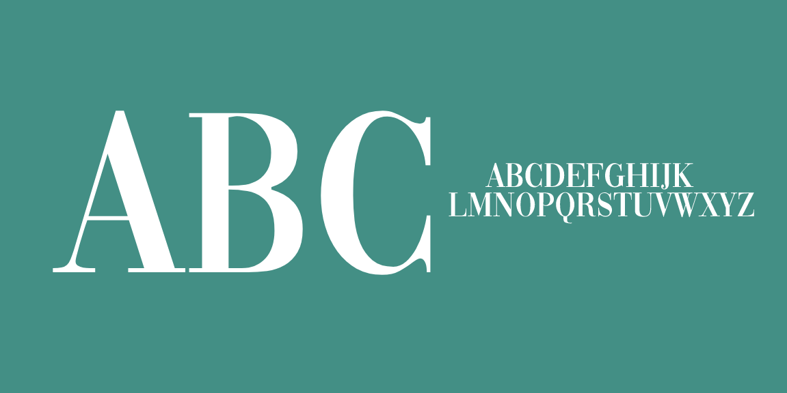

# Onboard

Onboarding comes from the English phrase "to get on board". It is often used by the aviation industry to define the act of getting passengers on board an aircraft, but it has another meaning in the corporate world.

## Image License
The images in this repository are licensed under the CC https://creativecommons.org/licenses/by-sa/4.0/

## License
This Font Software is licensed under the SIL Open Font License, Version 1.1.
This license is available with a FAQ at [https://openfontlicense.org]
